# Capturas de pantalla — Taller 1

Grupo N** — Integrantes: **********\_\_\_\_************

## Menú principal

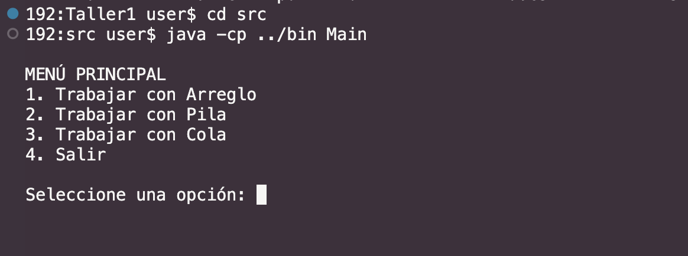

## Arreglo

### Insertar elemeDnto

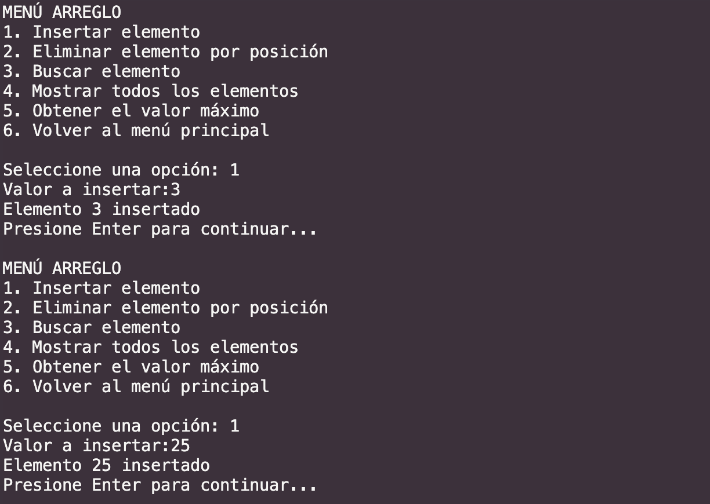

### Mostrar todos los elementos

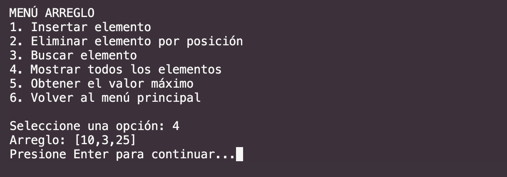

### Buscar elemento

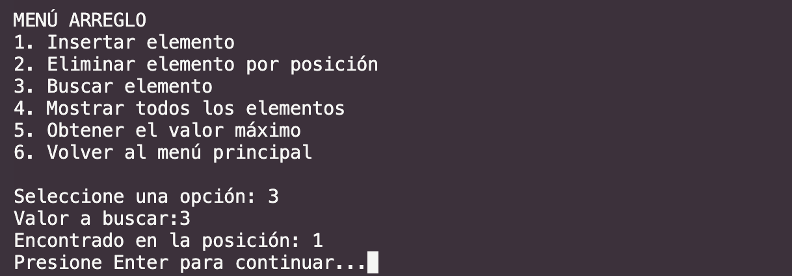

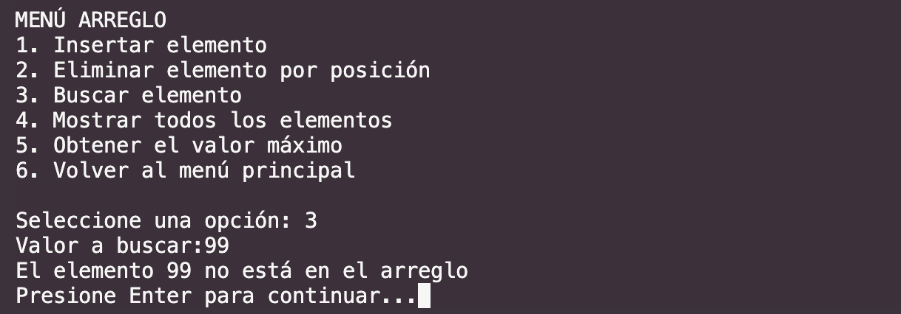

### Eliminar elemento por posición

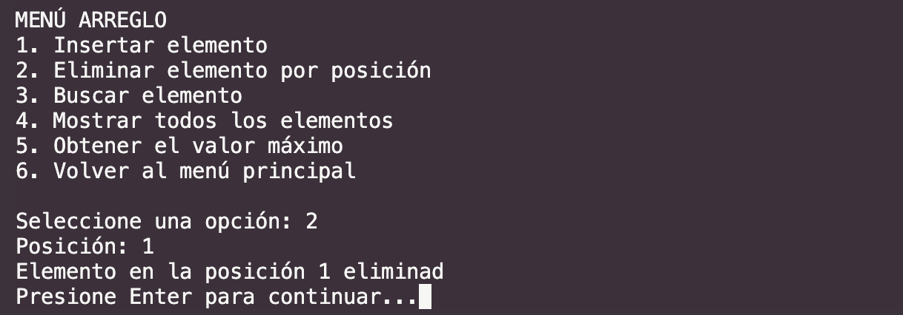

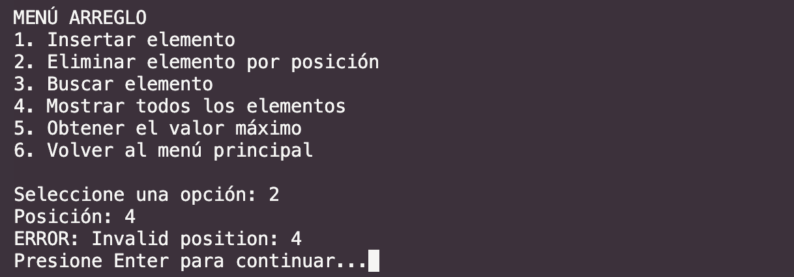

### Obtener el valor máximo

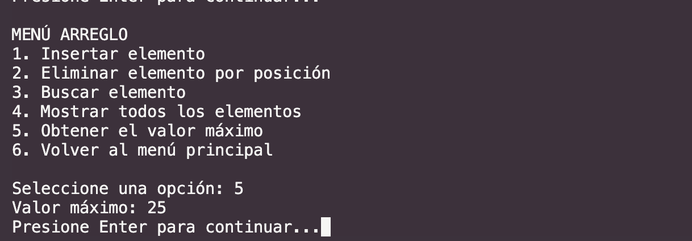

## Pila

### Apilar (push)

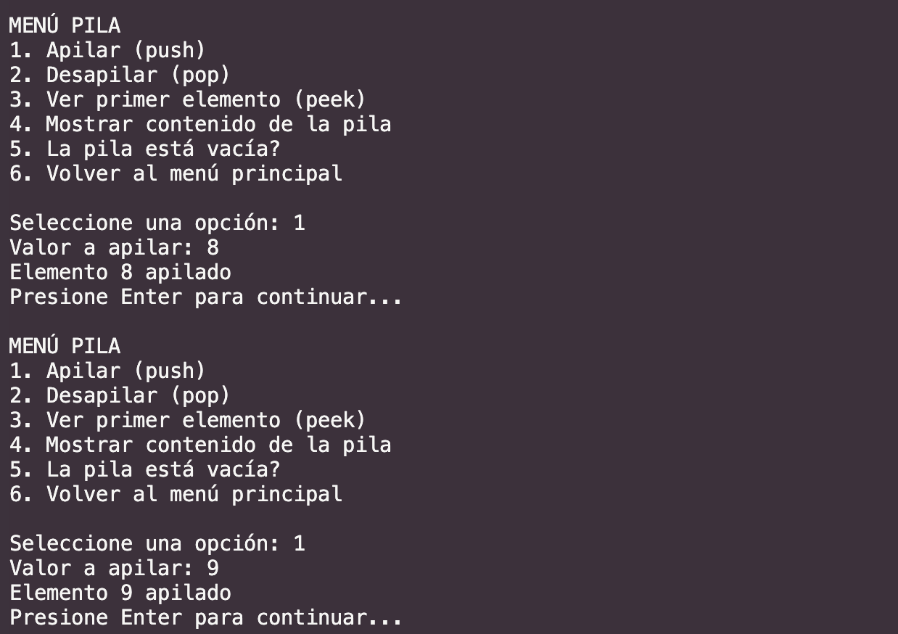

### Mostrar contenido de la pila

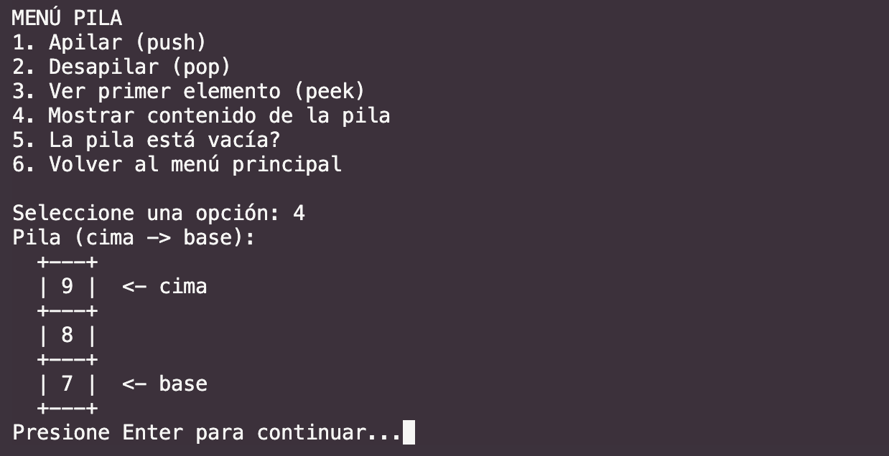

### Ver primer elemento (peek)

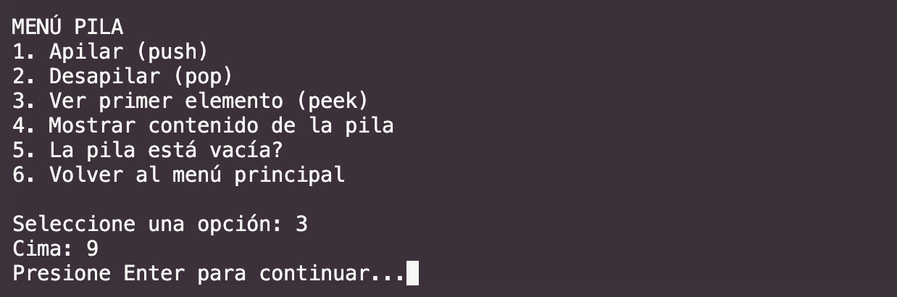

### Desapilar (pop)

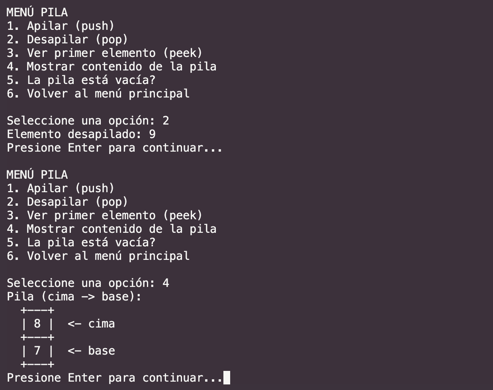

### ¿La pila está vacía?

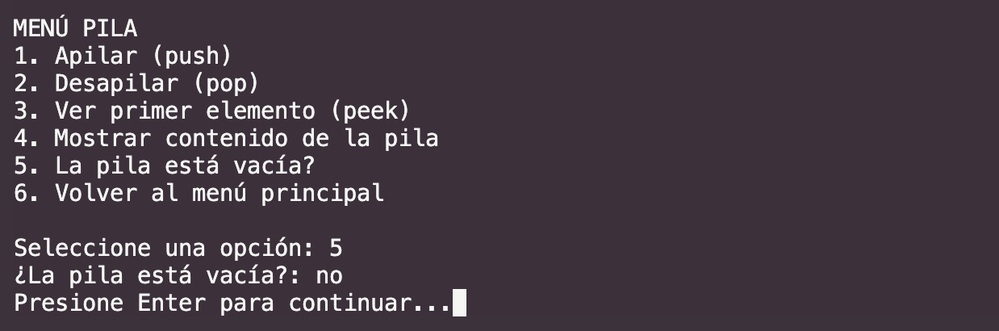

## Cola circular

### Encolar (enqueue)

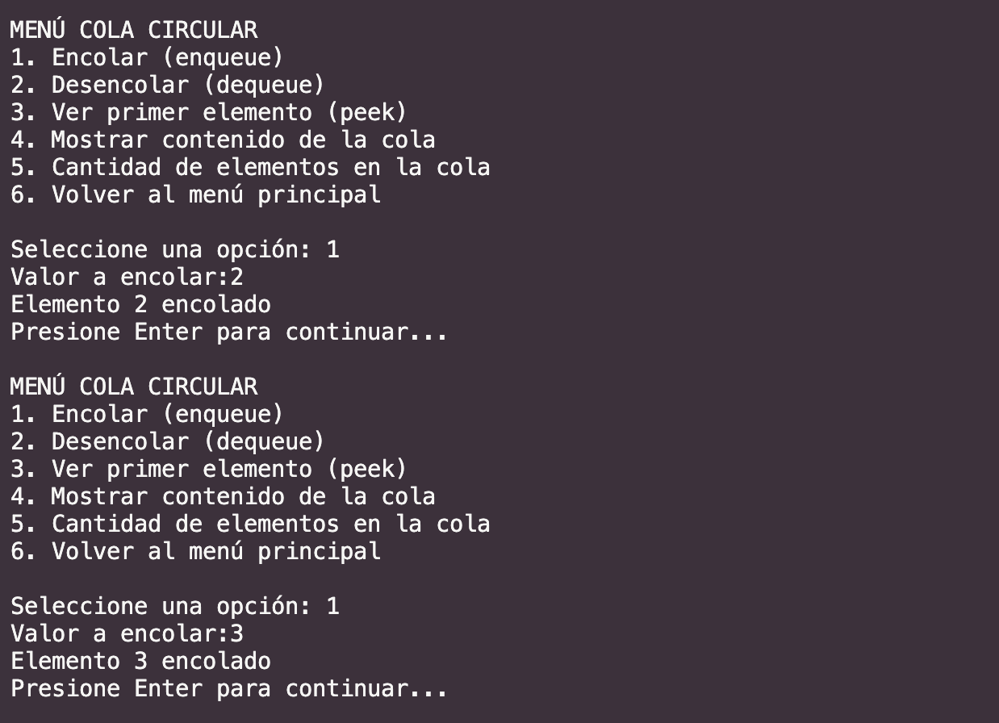

### Mostrar contenido de la cola

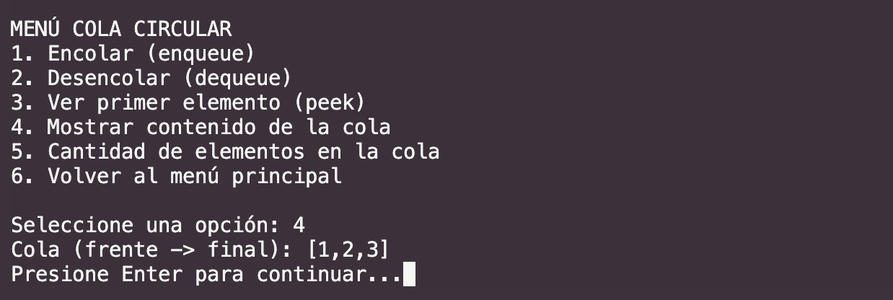

### Ver primer elemento (peek)

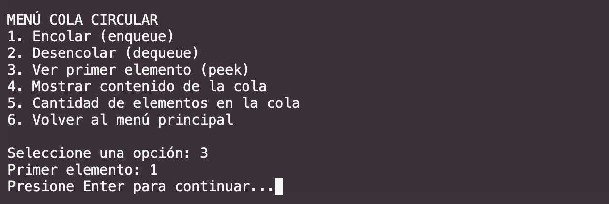

### Desencolar (dequeue)

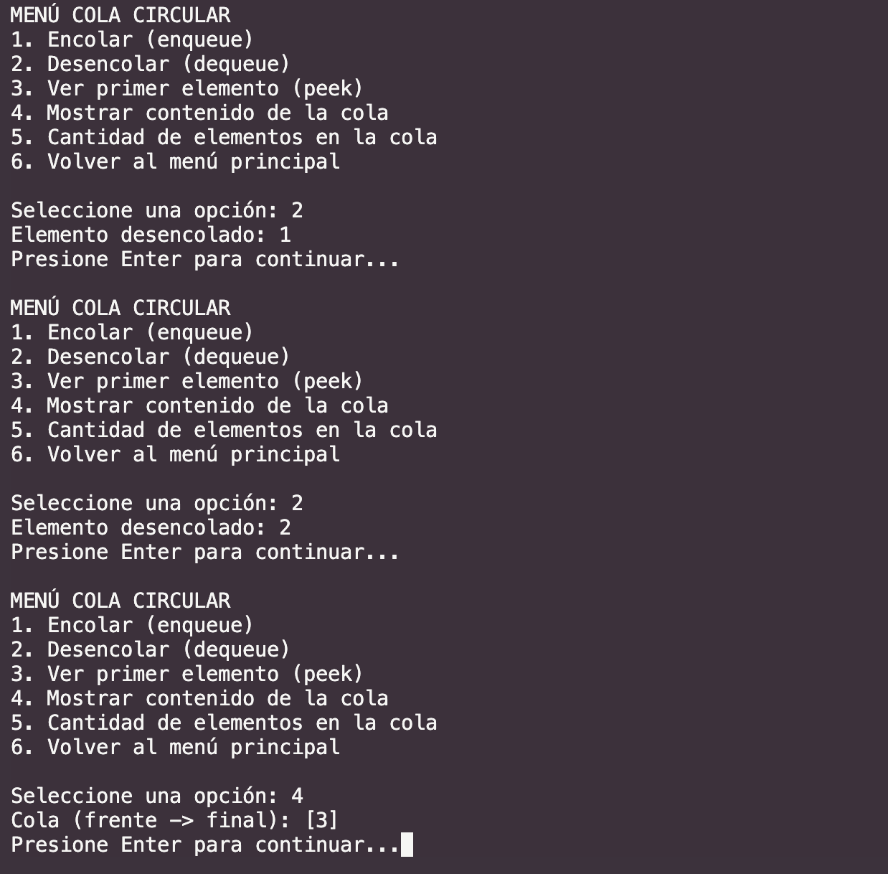

### Cantidad de elementos en la cola

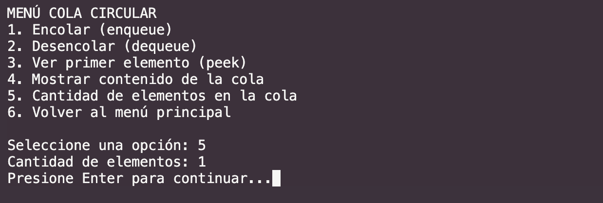

## Validaciones

### Opción de menú fuera de rango

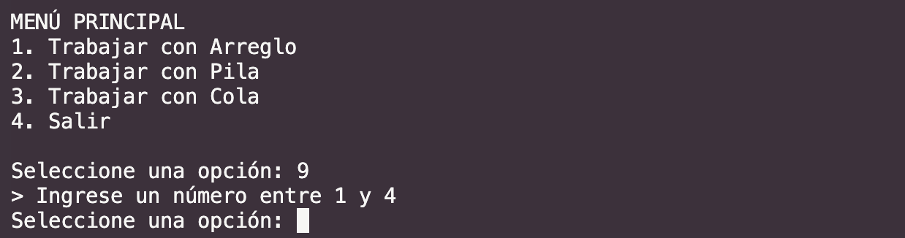

### Entrada no numérica

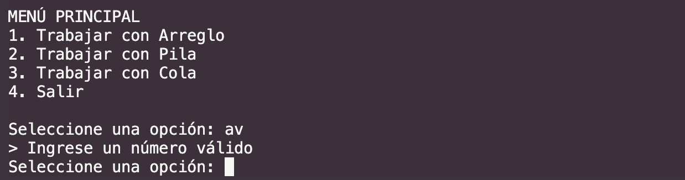

### Tamaño inválido al crear la estructura

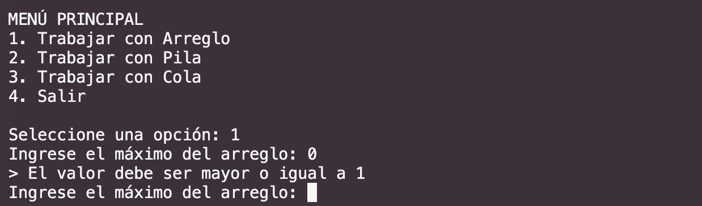

## Salir

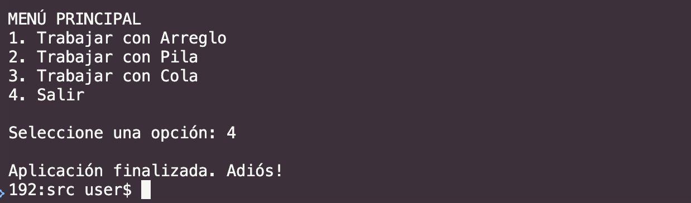
